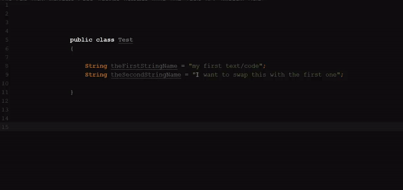

# Swap JetBrains/IntelliJ-Plugin
## About
Swap is an IntelliJ/JetBrains plugin that integrates "Swap" option in editor menu. Swap action copies selected code/text for future use and replace the selected code/text with previous clipboard one.

## How it works:
suppose we have 2 strings denoted as S1 and S2.

- first you copy S1 to clipboard.
- select S2 and hit 'swap'. It will replace S1 with S2 and S1 will be copied to clipboard.
- then select S2 and hit paste which will replace the S2 with S1.

## How to install: 

### manual installation)
- Download the swap.jar from the github download folder
- in your ide go to File >> Settings >> Plugins >> Install Plugin From Disk 
- Select the swap.jar file.
- Then select Ok

## Change Log:
### Version: 1.0.1:
- Initial release
- Compatable with most of the IntelliJ IDEs
